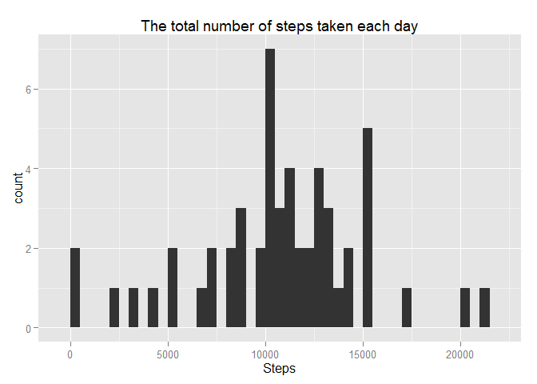
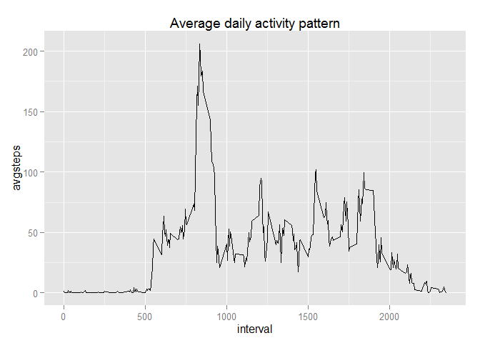
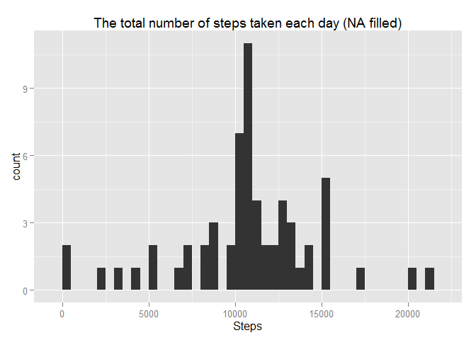
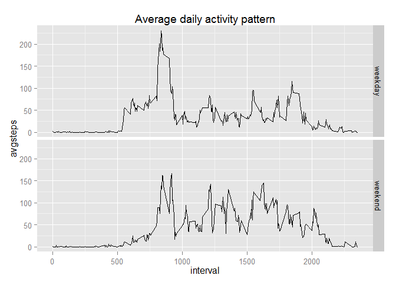

# Reproducible Research: Peer Assessment 1


## Loading and preprocessing the data

It's unzip downloaded file "activity.zip"
and load activities from "activity.csv" to variable **acts**  


```r
library(dplyr)
```

```
## 
## Attaching package: 'dplyr'
## 
## The following object is masked from 'package:stats':
## 
##     filter
## 
## The following objects are masked from 'package:base':
## 
##     intersect, setdiff, setequal, union
```

```r
library(ggplot2)
setwd("D:/Program/RepProject1/RepData_PeerAssessment1")
unzip("activity.zip")
acts<-read.csv("activity.csv")
head(acts)
```

```
##   steps       date interval
## 1    NA 2012-10-01        0
## 2    NA 2012-10-01        5
## 3    NA 2012-10-01       10
## 4    NA 2012-10-01       15
## 5    NA 2012-10-01       20
## 6    NA 2012-10-01       25
```

## What is mean total number of steps taken per day?


```r
stepsPerDay<-summarise(group_by(acts,date),sum(steps))
names(stepsPerDay)<-c("date","avgsteps")
qplot(stepsPerDay$avgsteps,main="The total number of steps taken each day",xlab="Steps",binwidth=500)
```

 

Calculate the mean total numbers of steps taken per day

```r
mean(stepsPerDay$avgsteps,na.rm=T)
```

```
## [1] 10766.19
```


Calculate the median total numbers of steps taken per day

```r
median(stepsPerDay$avgsteps,na.rm=T)
```

```
## [1] 10765
```

## What is the average daily activity pattern?


```r
stepsPerInterval<-summarise(group_by(acts,interval),mean(steps,na.rm=T))
names(stepsPerInterval)<-c("interval","avgsteps")
qplot(data=stepsPerInterval,interval,avgsteps,main="Average daily activity pattern",geom="line")
```

 

IID of 5-minute interval, on average across all the days in the dataset,
contains the maximum number of steps:


```r
m<-max(stepsPerInterval$avgsteps)
filter(stepsPerInterval,stepsPerInterval$avgsteps==m)$interval
```

```
## [1] 835
```

## Imputing missing values

Calculate and report the total number of missing values in the dataset
(i.e. the total number of rows with NAs)

```r
test<-is.na(acts$steps)
length(which(test))
```

```
## [1] 2304
```
Filling in all of the missing values in the dataset. I used the mean for that 5-minute interval.
Create a new dataset **acts2** that is equal to the original dataset but with the
missing data filled in.


```r
acts2<-acts

for(i in 1:nrow(acts)) {
  
  if (test[i]) {
    interval<-acts[i,"interval"]
    acts2[i,"steps"]<-stepsPerInterval[stepsPerInterval$interval==interval,]$avgsteps
    }
}

head(acts2)
```

```
##       steps       date interval
## 1 1.7169811 2012-10-01        0
## 2 0.3396226 2012-10-01        5
## 3 0.1320755 2012-10-01       10
## 4 0.1509434 2012-10-01       15
## 5 0.0754717 2012-10-01       20
## 6 2.0943396 2012-10-01       25
```


```r
stepsPerDay2<-summarise(group_by(acts2,date),sum(steps))
names(stepsPerDay2)<-c("date","avgsteps")
qplot(stepsPerDay2$avgsteps,main="The total number of steps taken each day (NA filled)",xlab="Steps",binwidth=500)
```

 

Calculate the mean total numbers of steps taken per day (NA filled)

```r
mean(stepsPerDay2$avgsteps)
```

```
## [1] 10766.19
```


Calculate the median total numbers of steps taken per day  (NA filled)

```r
median(stepsPerDay2$avgsteps)
```

```
## [1] 10766.19
```

## Are there differences in activity patterns between weekdays and weekends?


```r
loc<-Sys.getlocale("LC_TIME")
Sys.setlocale("LC_TIME", "English_United Kingdom.1252")
```

```
## [1] "English_United Kingdom.1252"
```

```r
acts2<-mutate(acts2,weekdays=ifelse( 
    (weekdays(as.POSIXct(acts2$date))=="Sunday" | weekdays(as.POSIXct(acts2$date))=="Saturday"), 
     "weekend", "weekday"))
acts2$weekdays<-as.factor(acts2$weekdays)

Sys.setlocale("LC_TIME",loc)
```

```
## [1] "Russian_Russia.1251"
```

```r
stepsPerInterval2<-summarise(group_by(acts2,weekdays,interval),mean(steps,na.rm=T))
names(stepsPerInterval2)<-c("weekdays","interval","avgsteps")
qplot(data=stepsPerInterval2,interval,avgsteps,facets=weekdays~.,main="Average daily activity pattern",geom="line")
```

 
